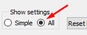
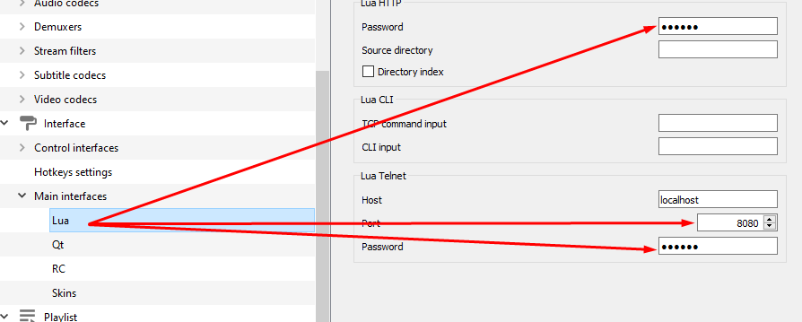
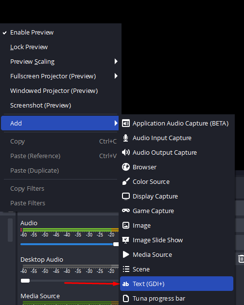
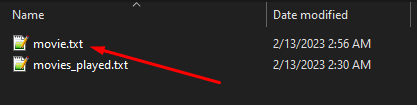

<h1>
OBS VLC - Runtime Overlay</h1>


**OBS VLC - Runtime Overlay** is a simple Utility Tool for **OBS** that displays **VLC** media running time on the screen by attaching a **`Text Source`**, which also supports additional formatting features that update in real-time upon modification.

### 🚀 Quickstart
<a href="#vlc-configuration">1. VLC Configuration</a>

<a href="#obs-configuration">2. OBS Configuration</a>

<a href="#-filters">3. Filters</a>

<a href="#-formatting">4. Formatting</a>

<h3 style="display: inline;">
VLC Configuration
</h3>
<hr>

- #### Go to Preferences in VLC


- #### Check all on Show settings


- #### Go to Main interfaces and check Web


- #### Set your `Host`, `Password` and `Port` in the fields indicated below


#### Make sure the `host`, `port` and `password` coincides with the `settings.json` file.


<br>
<h3 style="display: inline;">
OBS Configuration
</h3>
<hr>

- #### Add a Text Source and double click it


- #### Check the Read from file box and click Browse
  

- #### Select the `movie.txt` file in the `logs/` directory.

  


## ✨ Filters
Elements within the filter array allows you to remove any unnecessary text.

```
"filters": [
    ".",
    "mp4",
    "BluRay",
    "BrRip",
    "x264",
    "EXTENDED",
    "1080p",
    "2160p",
    ...
]
``` 

## 🔧 Formatting

| Tag                  | Description                                   |
| -------------------- | --------------------------------------------- |
| **`{title}`**        | the title of the current movie                |
| **`{h:m:s}`**        | shows media runtime formatted as **HH:MM:SS** |
| **`{h:m:s-length}`** | shows media length formatted as **HH:MM:SS**  |
| **`{br}`**           | triggers a breakline at current position      |
| **...**              |                                               |


# Author
**large BIG snooze**
- Github: [largeBIGsnooze](https://github.com/largeBIGsnooze)